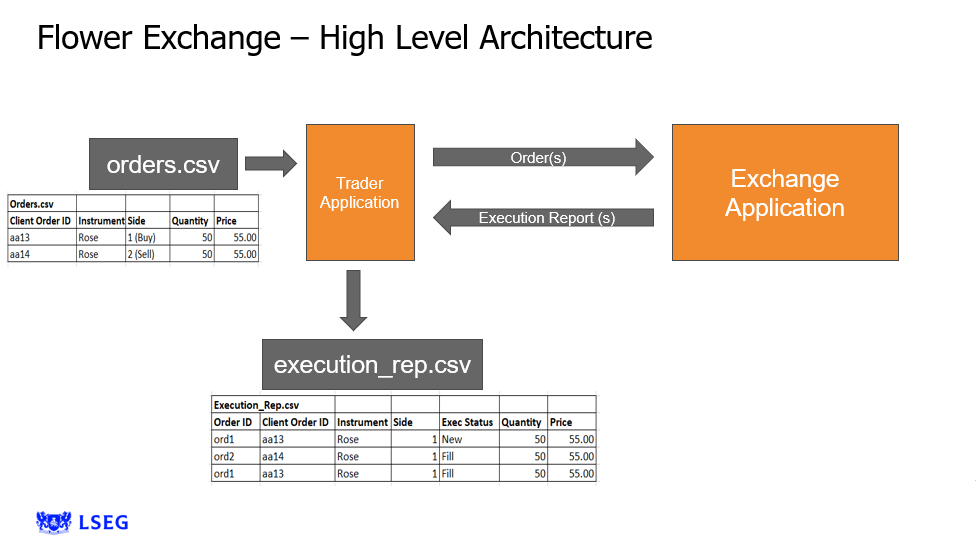

# Flower-Exchange-App
Flower Exchange App project given by the LSEG after conducting a c++ lescture series. Streamlining trade, it connects suppliers and buyers using Excel data. Smart matches and criteria-driven algorithms redefine flower transactions.

